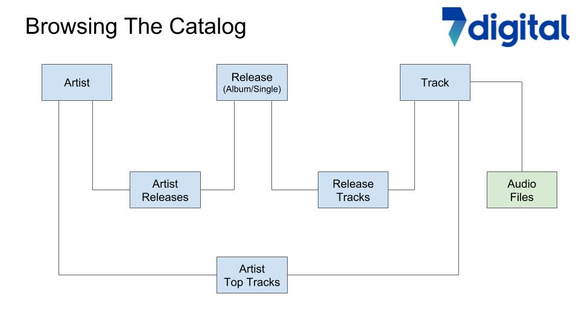
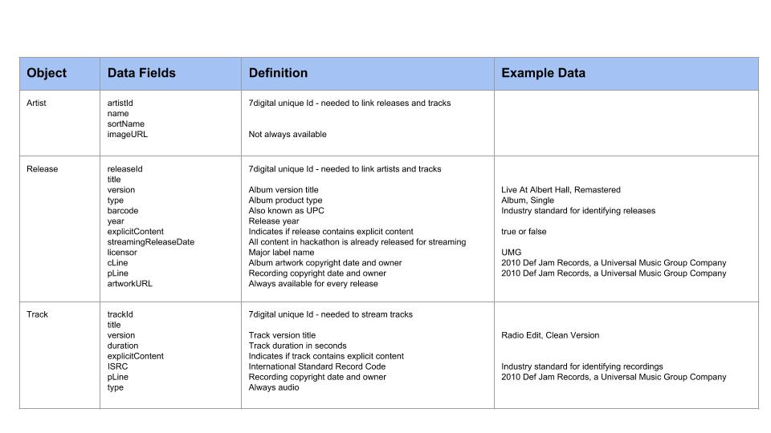
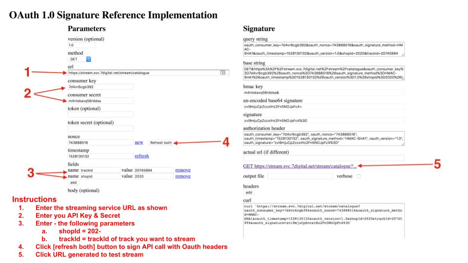

# Using 7Digital API

## Overview

**Capitol Music Group and its parent Universal Music Group have made a catalog of their songs available for the Hackathon**

* ≈ 1,500 unique artists \(US and Canadian\)
* ≈ 4,500 different albums/singles - all with cover artwork
* ≈ 14,000 tracks - all with full length audio streams
* The 7digital API’s can be used to
  * Browse the catalog by Artist and then find tracks for that artist
  * Stream the full-length audio for all tracks
  * Access cover artwork image files for all albums and singles in the catalog
* Each team will be given an API key and secret to access the APIs
  * Only the API key is required to browse the catalog
  * However, in order to stream the audio you will need to sign the API call with your key and secret

## **Important Information**

* API Keys 
  * **`Key = 7d4vr6cgb392`**
  * **`Secret = m4ntskavq56rddsa`**
* You need to add the following parameter to all API calls
  * **`&shopId=2020`**
* When calling track and release endpoints, always use parameter
  * **`&usageTypes=adsupportedstreaming`**
* Terminology
  * Release = Album or Single

## API Schema

## Catalog Endpoints

| **Link to Documentation** | **Description & Sample Call** |
| --- | --- | --- | --- | --- | --- | --- | --- | --- |
| [**GET /artist/browse**](http://docs.7digital.com/#_artist_browse_get) | **Returns a list of artists whose names match the start letter\(s\) supplied  -** [**http://api.7digital.com/1.2/artist/browse?letter=p&shopId=2020&oauth\_consumer\_key=7d4vr6cgb392**](http://api.7digital.com/1.2/artist/browse?letter=k&shopId=2020&oauth_consumer_key=7d4vr6cgb392) |
| [**GET /artist/search**](http://docs.7digital.com/#_artist_search_get) | **Returns a list of artists that match query string -**  [**http://api.7digital.com/1.2/artist/search?q=kiss&shopId=2020&oauth\_consumer\_key=7d4vr6cgb392**](http://api.7digital.com/1.2/artist/search?q=kiss&shopId=2020&oauth_consumer_key=7d4vr6cgb392) |
| [**GET /artist/details**](http://docs.7digital.com/#_artist_details_get) | **Returns metadata for a specific artist -**  [**http://api.7digital.com/1.2/artist/details?artistId=298&shopId=2020&oauth\_consumer\_key=7d4vr6cgb392**](http://api.7digital.com/1.2/artist/details?artistId=298&shopId=2020&oauth_consumer_key=7d4vr6cgb392) |
| [**GET /artist/releases**](http://docs.7digital.com/#_artist_releases_get) | **Returns a list of streamable releases for a specific artist** [**http://api.7digital.com/1.2/artist/releases?artistId=298&shopId=2020&usageTypes=adsupportedstreaming&oauth\_consumer\_key=7d4vr6cgb392**](http://api.7digital.com/1.2/artist/releases?artistId=298&shopId=2020&usageTypes=adsupportedstreaming&oauth_consumer_key=7d4vr6cgb392) |
| [**GET /artist/toptracks**](http://docs.7digital.com/#_artist_toptracks_get) | **Returns a list of top tracks for a specific artist** [**http://api.7digital.com/1.2/artist/toptracks?artistId=298&shopId=2020&usageTypes=adsupportedstreaming&oauth\_consumer\_key=7d4vr6cgb392**](http://api.7digital.com/1.2/artist/toptracks?artistId=298&shopId=2020&usageTypes=adsupportedstreaming&oauth_consumer_key=7d4vr6cgb392) |
| [**GET /release/details**](http://docs.7digital.com/#_release_details_get) | **Returns metadata for a specific release** [**http://api.7digital.com/1.2/release/details?releaseId=1927424&shopId=2020&oauth\_consumer\_key=7d4vr6cgb392&usageTypes=adsupportedstreaming&imageSize=800**](http://api.7digital.com/1.2/release/details?releaseId=1927424&shopId=2020&oauth_consumer_key=7d4vr6cgb392&usageTypes=adsupportedstreaming&imageSize=800) |
| [**GET /release/tracks**](http://docs.7digital.com/#_release_tracks_get) | **Returns list of tracks for a specific release** [**http://api.7digital.com/1.2/release/tracks?releaseId=1927424&shopId=2020&oauth\_consumer\_key=7d4vr6cgb392&usageTypes=adsupportedstreaming**](http://api.7digital.com/1.2/release/tracks?releaseId=1927424&shopId=2020&oauth_consumer_key=7d4vr6cgb392&usageTypes=adsupportedstreaming) |
| [**GET /track/details**](http://docs.7digital.com/#_track_details_get) | **Returns metadata for a specific track** [**http://api.7digital.com/1.2/track/details?trackId=5075620&shopId=2020&oauth\_consumer\_key=7d4vr6cgb392&usageTypes=adsupportedstreaming**](http://api.7digital.com/1.2/track/details?trackId=5075620&shopId=2020&oauth_consumer_key=7d4vr6cgb392&usageTypes=adsupportedstreaming) |

For JSON responses

* **`Add “accept: application/json” to your http header request`**
* **`curl -H “Accept: application/json” ‘`**[**`http://api.7digital.com…`**](about:blank)**`..’`**

## Accessing Album/Single Cover Art

**The release endpoint responses return a link to the album artwork - example from \(1st\) call above**

[**http://artwork-cdn.7static.com/static/img/sleeveart/00/019/274/0001927424\_800.jpg**](http://artwork-cdn.7static.com/static/img/sleeveart/00/019/274/0001927424_800.jpg)

Sizes available - 33, 50, 100, 180, 182, 200, 350, 500 and 800 pixels

_The size of images returned by any API response can be adjusted by adding imageSize parameter to the request_

## Catalog Metadata

**Streaming Audio**

To stream a track you will need to build your own API call to the 7digital streaming service

* All streaming links need to be "Oauth" signed using the API Key & Secret
* _**Once generated a streaming link is only valid for 60 minutes and can only be used once**_ 

In order to stream a specific track you must specify a 7digital trackId

* 7digital trackId's are returned by the catalog search API endpoints

Documentation on how to build a streaming link can be found here -  [GET /stream/catalogue](http://docs.7digital.com/#_stream_catalogue_get) 

This is what a typical streaming link looks like - \(note this link does not work\)[**`https://stream.svc.7digital.net/stream/catalogue?&shopId=2020&trackId=20745994&oauth_consumer_key=7d4vr6cgb392&oauth_nonce=302909674&oauth_signature_method=HMAC-SHA1&oauth_timestamp=1520701629&oauth_version=1.0&oauth_signature=gnTthfLuZWAf55MTvOesq25ONlc`**](https://stream.svc.7digital.net/stream/catalogue?&shopId=2020&trackId=20745994%20&oauth_consumer_key=7d4vr6cgb392%20&oauth_nonce=302909674%20&oauth_signature_method=HMAC-SHA1%20&oauth_timestamp=1520701629&oauth_version=1.0%20&oauth_signature=gnTthfLuZWAf55MTvOesq25ONlc%3D)

To help build streaming links and sign them with Oauth headers we have a form that you can use here - [**7digital Oauth signature reference**](http://7digital.github.io/oauth-reference-page/)

Here is an example of how to complete that form

