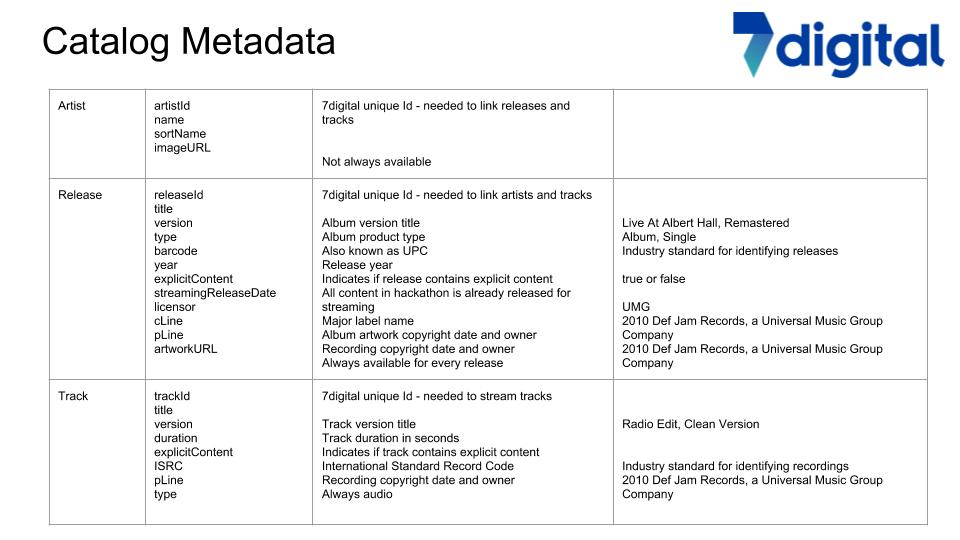

# Using 7Digital API

**Capitol Music Group and its parent Universal Music Group have made a catalog of their songs available for the Hackathon**

* ≈ 1,500 unique artists \(US and Canadian\)
* ≈ 4,500 different albums/singles - all with cover artwork
* ≈ 14,000 tracks - all with full length audio streams
* The 7digital API’s can be used to
  * Browse the catalog by Artist and then find tracks for that artist
  * Stream the full-length audio for all tracks
  * Access cover artwork image files for all albums and singles in the catalog
* Each team will be given an API key and secret to access the APIs
  * Only the API key is required to browse the catalog
  * However, in order to stream the audio you will need to sign the API call with your key and secret

**Important Information**

* You need to add the following parameter to all API calls
  * &shopId=2020
* When calling track and release endpoints, always use parameter
  * &usageTypes=adsupportedstreaming
* Terminology
  * Release = Album or Single

| **Link to Documentation** | **Description & Sample Call** |
| --- | --- | --- | --- | --- | --- | --- | --- | --- |
| [**GET /artist/browse**](http://docs.7digital.com/#_artist_browse_get) | **Returns a list of artists whose names match the start letter\(s\) supplied  -** [**http://api.7digital.com/1.2/artist/browse?letter=p&shopId=2020&oauth\_consumer\_key=7d4vr6cgb392**](http://api.7digital.com/1.2/artist/browse?letter=k&shopId=2020&oauth_consumer_key=7d4vr6cgb392) |
| [**GET /artist/search**](http://docs.7digital.com/#_artist_search_get) | **Returns a list of artists that match query string -**  [**http://api.7digital.com/1.2/artist/search?q=kiss&shopId=2020&oauth\_consumer\_key=7d4vr6cgb392**](http://api.7digital.com/1.2/artist/search?q=kiss&shopId=2020&oauth_consumer_key=7d4vr6cgb392) |
| [**GET /artist/details**](http://docs.7digital.com/#_artist_details_get) | **Returns metadata for a specific artist -**  [**http://api.7digital.com/1.2/artist/details?artistId=298&shopId=2020&oauth\_consumer\_key=7d4vr6cgb392**](http://api.7digital.com/1.2/artist/details?artistId=298&shopId=2020&oauth_consumer_key=7d4vr6cgb392) |
| [**GET /artist/releases**](http://docs.7digital.com/#_artist_releases_get) | **Returns a list of streamable releases for a specific artist -** [**http://api.7digital.com/1.2/artist/releases?artistId=298&shopId=2020&usageTypes=adsupportedstreaming&oauth\_consumer\_key=7d4vr6cgb392**](http://api.7digital.com/1.2/artist/releases?artistId=298&shopId=2020&usageTypes=adsupportedstreaming&oauth_consumer_key=7d4vr6cgb392) |
| [**GET /artist/toptracks**](http://docs.7digital.com/#_artist_toptracks_get) |  |
| [**GET /release/details**](http://docs.7digital.com/#_release_details_get) |  |
| [**GET /release/tracks**](http://docs.7digital.com/#_release_tracks_get) |  |
| [**GET /track/details**](http://docs.7digital.com/#_track_details_get) |  |

**The release endpoint responses return a link to the album artwork - example from \(1st\) call above**

[**http://artwork-cdn.7static.com/static/img/sleeveart/00/019/274/0001927424\_800.jpg**](http://artwork-cdn.7static.com/static/img/sleeveart/00/019/274/0001927424_800.jpg)

Sizes available - 33, 50, 100, 180, 182, 200, 350, 500 and 800 pixels

_The size of images returned by any API response can be adjusted by adding imageSize parameter to the request_

