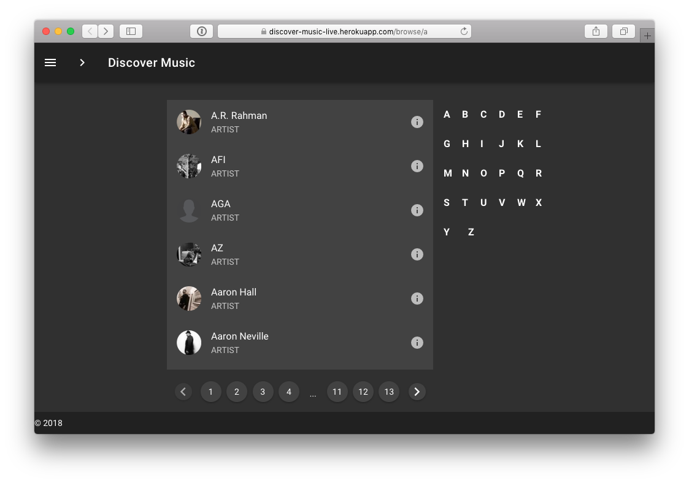

# Discover Music


### **Discover Music is a complete, ready-to-run example app that integrates APIs from The 7Digital UMG Catalog, Cloudinary, Microsoft, Tivo, and more!** 


The app provides an interactive Vue-based front-end, which allows you to search and sort your way through a massive music catalog, supplied by 7Digital. Notable features:

* Album and artist images are cropped, padded, optimized and delivered using Cloudinary
* Artists, albums, and tracks are fetched using the [Music Discovery Service API](https://github.com/cloudinary-developers/music-discovery-service), which Cloudinary built just for this hackathon.
* The front-end is powered by Vue; notable components include [Vue-APlayer](https://vue-aplayer.js.org), and [vue-social-sharing](https://www.npmjs.com/package/vue-social-sharing).

Feel free to use, modify and extend this blueprint apps for your Hack.


View the demo:  ****[**Discover Music**](https://discover-music-live.herokuapp.com)  
**Download and install the source code:**  
 [**https://github.com/cloudinary-developers/discover-cmg-music**](https://github.com/cloudinary-developers/discover-cmg-music)

Make it your own!


