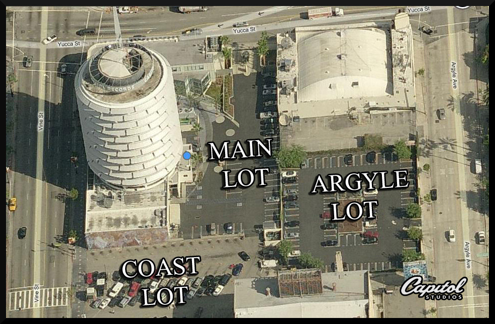

# Arrival Guide

## API Training Workshop: June 1

| **Where** | UMG Headquarters - 2220 Colorado Ave, Los Angeles, CA 90404 |
| --- | --- |
| **When** | 10am - 2pm    |

## Hackathon: June 2-3

| **Where** | Capitol Records - 1750 vine St, Los Angeles, CA 90028 |
| --- | --- | --- | --- |
| **Registration / Office Hours** | Saturday June 2 at 11am - 1pm  |
| **Closing Mixer** | Sunday June 3 at 4pm |
| **Key Contacts** |  &lt;!--
  /\* Font Definitions \*/
  @font-face
 	{font-family:"Cambria Math";
 	panose-1:2 4 5 3 5 4 6 3 2 4;
 	mso-font-charset:1;
 	mso-generic-font-family:roman;
 	mso-font-pitch:variable;
 	mso-font-signature:0 0 0 0 0 0;}
 @font-face
 	{font-family:Calibri;
 	panose-1:2 15 5 2 2 2 4 3 2 4;
 	mso-font-charset:0;
 	mso-generic-font-family:swiss;
 	mso-font-pitch:variable;
 	mso-font-signature:-536859905 -1073732485 9 0 511 0;}
  /\* Style Definitions \*/
  p.MsoNormal, li.MsoNormal, div.MsoNormal
 	{mso-style-unhide:no;
 	mso-style-qformat:yes;
 	mso-style-parent:"";
 	margin-top:0in;
 	margin-right:0in;
 	margin-bottom:8.0pt;
 	margin-left:0in;
 	line-height:107%;
 	mso-pagination:widow-orphan;
 	font-size:11.0pt;
 	font-family:"Calibri",sans-serif;
 	mso-ascii-font-family:Calibri;
 	mso-ascii-theme-font:minor-latin;
 	mso-fareast-font-family:Calibri;
 	mso-fareast-theme-font:minor-latin;
 	mso-hansi-font-family:Calibri;
 	mso-hansi-theme-font:minor-latin;
 	mso-bidi-font-family:"Times New Roman";
 	mso-bidi-theme-font:minor-bidi;}
 a:link, span.MsoHyperlink
 	{mso-style-priority:99;
 	color:\#0563C1;
 	mso-themecolor:hyperlink;
 	text-decoration:underline;
 	text-underline:single;}
 a:visited, span.MsoHyperlinkFollowed
 	{mso-style-noshow:yes;
 	mso-style-priority:99;
 	color:\#954F72;
 	mso-themecolor:followedhyperlink;
 	text-decoration:underline;
 	text-underline:single;}
 .MsoChpDefault
 	{mso-style-type:export-only;
 	mso-default-props:yes;
 	font-family:"Calibri",sans-serif;
 	mso-ascii-font-family:Calibri;
 	mso-ascii-theme-font:minor-latin;
 	mso-fareast-font-family:Calibri;
 	mso-fareast-theme-font:minor-latin;
 	mso-hansi-font-family:Calibri;
 	mso-hansi-theme-font:minor-latin;
 	mso-bidi-font-family:"Times New Roman";
 	mso-bidi-theme-font:minor-bidi;}
 .MsoPapDefault
 	{mso-style-type:export-only;
 	margin-bottom:8.0pt;
 	line-height:107%;}
 @page WordSection1
 	{size:8.5in 11.0in;
 	margin:1.0in 1.0in 1.0in 1.0in;
 	mso-header-margin:.5in;
 	mso-footer-margin:.5in;
 	mso-paper-source:0;}
 div.WordSection1
 	{page:WordSection1;}
 --&gt;
  |

## Parking

For the June 1st workshop, enter the underground garage below 2220 Colorado Ave, and take your car to Valet. Be sure to have your ticket validated by reception.

For the June 2-3 Hackathon at 1750 Vine St, kindly note that parking is limited. If you're driving, enter through the gate at Yucca St, and pres the intercom button to check-in with security. Tell them your name and that you're here for the Capitol Hackathon. The first 30 people to arrive will be directed to park in the Main Lot \(see photo\). All subsequent arrivals will be directed to park in the Argyle lot until it hits capacity. 

If you're ubering, please enter via the back gate beyond the mural on the south side of the Tower \(located on the same side as the Coast Lot in the below photo\).


 Super-powers are granted randomly so please submit an issue if you're not happy with yours.


Once you're strong enough, save the world:

