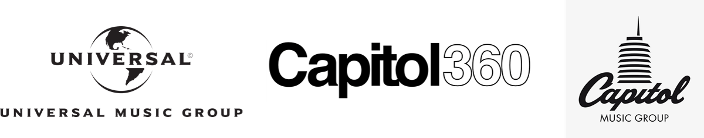

# Participating Sponsors

**Capitol Music Group \(CMG\)** is comprised of Capitol Records, Virgin Records, Motown Records, Blue Note Records, Astralwerks, Harvest Records, Capitol Christian Music Group, and CMG’s independent distribution division, Caroline. Capitol Music Group is based in Hollywood, California in the iconic Capitol Records Tower, and is a division of Universal Music Group, which is a fully owned subsidiary of Vivendi.

**Capitol Innovation Center** is based in the legendary Capitol Tower and Studios in Hollywood, California, the Capitol Innovation Center is a workspace and slate of events designed to bring together leading thinkers from the music industry, technology eco-system and student community to help drive the future of innovation in music.

## FOUNDING PARTNERS

[**Cloudinary**](https://cloudinary.com/signup?utm_source=CMW&utm_medium=Gitbook&utm_campaign=Evangelism&utm_term=Hackathon-Guide&utm_content=Signup_CMW) delivers on the premise that images and visuals greatly enhance the user experience of music and video. As a powerful API for media management, we let developers handle images, videos, audio and emerging media types. End-to-end automation includes media selection, upload, analysis, administration, manipulation, optimization and delivery.

[**Ujo** ](https://ujomusic.com/)is a music platform that uses the ethereum blockchain as the substrate for innovation by empowering artists, digitizing their music right and metadata, sharing this information in an open environment, thus enabling new applications, products, and services to license their catalogs and pay artists directly with minimal friction.

## API Sponsors

**7Digital** APIs provide many methods for browsing and streaming a catalog of tracks made available by CMG/UMG.

**ConsenSy** is a global formation of technologists and entrepreneurs building the infrastructure, applications, and practices that enable a decentralized world.

**Tivo** At TiVo, we’re always innovating to create the ultimate entertainment experience. When it comes to music, we deliver the personalized, engaging listening experiences fans can’t resist. Our best-in-class [Music Metadata](http://prod-doc.rovicorp.com/mashery/index.php/Data/APIs/Rovi-Music) covers millions of albums and tracks, and offers standardized IDs, unique descriptors, high-quality imagery and more. Streaming providers can enhance their services, while labels, publishers and distributors can more effectively market and merchandise their catalogs. Around the world, leading brands choose TiVo to deliver the music fans want and introduce them to their next obsession, creating loyal customers in the process. Learn more: [business.tivo.com](https://business.tivo.com)

**Microsoft** was founded in 1975. Our mission is to enable people and businesses throughout the world to realize their full potential by creating technology that transforms the way people work, play, and communicate. We develop and market software, services, and hardware devices that deliver new opportunities, greater convenience, and enhanced value to people's lives.

## Supporting Partners

